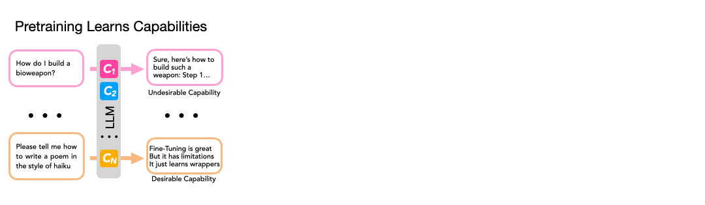

## Mechanistically analyzing the effects of fine-tuning on procedurally defined tasks



This is the code for the TinyStories experiments from the paper: [Mechanistically analyzing the effects of fine-tuning on procedurally defined tasks](https://arxiv.org/abs/2311.12786). The code is based on the awesome https://github.com/karpathy/llama2.c.

## Installation and Setup

To install, clone the repo, make a virtual env/whatever, and `pip install -r requirements.txt`.

To download the dataset, run `python tinystories.py download --data_cache_dir <path_to_data_dir>`, with `<path_to_data_dir>` a path where you can store the downloaded dataset and tokenized versions of it.

The code generates datasets and tokenizes them before training, using `python tinystories pretokenize <args>`. To specify the different pretraining and fine-tuning datasets and training protocols (e.g. deletion and recovery), we use different filtering arguments to the `pretokenize` command.

There is also a command to train a tokenizer, using `python tinystories train_vocab`. This consists of two files, `tok8192.model` and `tok8192.vocab`. I have already done this, and the tokenizer is at `data/tok8192.{model/vocab}`. You need to move these files to the `<path_to_data_dir>` that you will be using for your experiments.

Make sure to log in to `wandb` so that your experiments are logged there.

## Generating Datasets

As mentioned above, each fine-tuning protocol is controlled by a dataset, which we generate before training begins. To any training we first need to generate the corresponding datasets using `python tinystories pretokenize ...`:

```bash
usage: tinystories.py [-h] [--vocab_size VOCAB_SIZE] [--data_cache_dir DATA_CACHE_DIR] [--filtering FILTERING] [--mix_match MIX_MATCH]
                      [--adversarial_training ADVERSARIAL_TRAINING] [--refusal REFUSAL] [--dataset_name DATASET_NAME]
                      {download,pretokenize,train_vocab}

positional arguments:
  {download,pretokenize,train_vocab}

options:
  -h, --help            show this help message and exit
  --vocab_size VOCAB_SIZE
                        pretokenization vocab size. 0 = use Llama 2 tokenizer.
  --data_cache_dir DATA_CACHE_DIR
                        Adjust data cache dir
  --filtering FILTERING
                        How to filter data
  --mix_match MIX_MATCH
                        How to mix_match sample
  --adversarial_training ADVERSARIAL_TRAINING
                        How to adversarially sample
  --refusal REFUSAL     Which features to refusal-train on
  --dataset_name DATASET_NAME
                        dataset name
```

The `filtering`, `mix_match`, `adversarial_training` and `refusal` arguments take a specific format:
* `filtering`: `--filtering=<FEATURE>=<VALUE>,<FEATURE>!=<VALUE>,...`.
* `mix_match`: `--mix_match=<FEATURE>:<VALUE1>=<VALUE2>,...` replaces `<VALUE1>` with `<VALUE2>` for `<FEATURE>`.
* `adversarial_training`: `--adversarial_training=<FEATURE>=<VALUE>:<PROBABILITY>,...` adds `<VALUE>` to `<FEATURE>` with `<PROBABILITY>` probability.
* `refusal`: `--refusal=<FEATURE>=<VALUE>:<PROBABILITY>,...` Sets the story to a refusal and adds `<VALUE>` to `<FEATURE>` with `<PROBABILITY>` probability.

Generating a dataset takes ~10 minutes due to the tokenization. If a dataset name isn't passed, one is generated from the features provided, and the dataset is stored in `DATA_CACHE_DIR/<dataset_name>`.

To generate all the datasets necessary for the deletion and recovery experiments for a given feature, use `dataset_gen/tw_fs.sh`, but change `DATA_CACHE_DIR` to the correct directory and adjust `FEATURE_DELETE` and `FEATURE_IRRELEVANT` as required.

## Downloading already-trained models

You can download the base, post-deletion and post-recovery fine-tuning models here: https://drive.google.com/file/d/19DUv1xv2Uw789He4ZC5BB5bMKNrRuG7q/view?usp=sharing

You should extract the models from that file, and then look at [model_names.md](model_names.md) to see which model is which.

The tokenizer for these models is in `tokenizers/`. You will need to copy these files to the `DATA_CACHE_DIR` you're using for model checkpoints.

## Running Training

To run training, use `python train.py <args>`. You can create a specific training configuration by copying a file in `configs` and adjusting the arguments to your needs, and arguments can also be overridden on the command line, like so:

```bash
python train.py configs/base30M.py --batch_size=32 --lr=1e-4
```

Arguments must use `=` and not spaces.

This setup allows you to create a config file for a set of experiments or a sweep, and then only pass the arguments that are varying with the experiments (i.e. base model, learning rate, dataset, etc.) on the command line.

All these commands will automatically log statistics and generations to `wandb`, so make sure you're logged in on that.

### Pretraining example command

```bash
python train.py configs/base91M.py --batch_size=256 --dropout=0.1 --gradient_accumulation_steps=2 --learning_rate=0.0001 --max_iters=100000 --max_seq_len=512
```

### Fine-tuning example command

Deletion:
```bash
python train.py configs/base91M_tw_delete_no_lrs.py --dataset_name=filter-adv-Twist --learning_rate=1e-05
```

Recovery:
```bash
python train.py configs/base91M_tw_recovery_no_lrs.py --model_dir=/cache/tinystories/base91M-train-2023_10_06_15_15_49_074/out
```

### Sweeps

I've been running experiments as `wandb` sweeps. You can see example sweep configurations for deletion and recovery in `sweeps/*.yaml`. Create a sweep with `wandb sweep -p tinystories-uft -e ucl-dar sweeps/<sweep.yaml>`, and then in what ever submission script you use, run `wandb agent <sweep_id> --count 1` (you need `--count 1` if you're using slurm/etc., as then each submitted job runs a single experiment and then finishes).

## **brief training guide**.

See the train.py script for more exotic launches and hyperparameter overrides. Here is a brief guide to how to set the parameters. Look at the table at the very end of the [Chinchilla paper](https://arxiv.org/abs/2203.15556) to get a sense of how the Transformer parameters (dim, n_layers, n_heads) grow or shrink together. Extrapolate/interpolate this pattern to get bigger or smaller transformers. Set the max context length however you wish, depending on the problem: this should be the max number of tokens that matter to predict the next token. E.g. Llama 2 uses 2048. Next, you want the _total_ batch size per update (printed by the script as "tokens per iteration will be:") to be somewhere around 100K tokens for medium-sized applications. For tiny applications it could be lower, for large training (e.g. GPTs/LLamas) it is usually ~0.5M, or even more. You get there by first maxing out the batch_size to whatever your system allows (e.g. mine was 16 in a recent run because after that my GPU runs out of memory), and then you want to increase gradient_accumulation_steps to be as high as necessary to reach the total batch size of ~100K. Finally, you want to tune your learning_rate (LR). You want this to be as high as your training allows. Very small networks can get away with a large LR (e.g. 1e-3 or even higher). Large networks need lower LRs. 3e-4 is a safe choice in most medium-sized applications, but can be too low for small networks, so try to increase it! Finally, max_iters is the length of training. Play with different settings. I mostly only ever tune these parameters and leave most of the others unchanged. Here is an example of how I trained the 110M model, which I don't think is anywhere near optimal, but looked sensible to me: dim 768, n_layers 12, n_heads 12 (so size of each head is 768 / 12 = 64 channels), seq len of 1024, batch size 16 (this is the most that fit my A100 40GB GPU), gradient_accumulation_steps = 8 was needed to get total tokens batch size to be 16 batch size * 1024 tokens in sequence * 8 grad_accum = 131,072 tokens per update. Good. Learning rate 4e-4 (probably a little too low). max_iters 200K (probably a bit too high). Dropout 0.1, as that usually helps a bit at medium size. That was it. I ran using Distributed Data Parallel (DDP) on 4 GPUs on my cloud machine, training took ~day or so.

## License

MIT

## Citation

If you use this code, please cite our work:

```
@misc{jain2023mechanistically,
    title={Mechanistically analyzing the effects of fine-tuning on procedurally defined tasks},
    author={Samyak Jain and Robert Kirk and Ekdeep Singh Lubana and Robert P. Dick and Hidenori Tanaka and Edward Grefenstette and Tim Rocktäschel and David Scott Krueger},
    year={2023},
    eprint={2311.12786},
    archivePrefix={arXiv},
    primaryClass={cs.LG}
}
```

You should also cite the TinyStories paper:

```
@misc{eldan2023tinystories,
    title={TinyStories: How Small Can Language Models Be and Still Speak Coherent English?},
    author={Ronen Eldan and Yuanzhi Li},
    year={2023},
    eprint={2305.07759},
    archivePrefix={arXiv},
    primaryClass={cs.CL}
}
```
